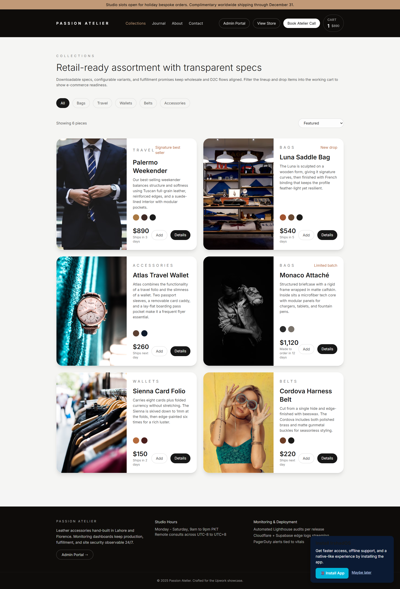
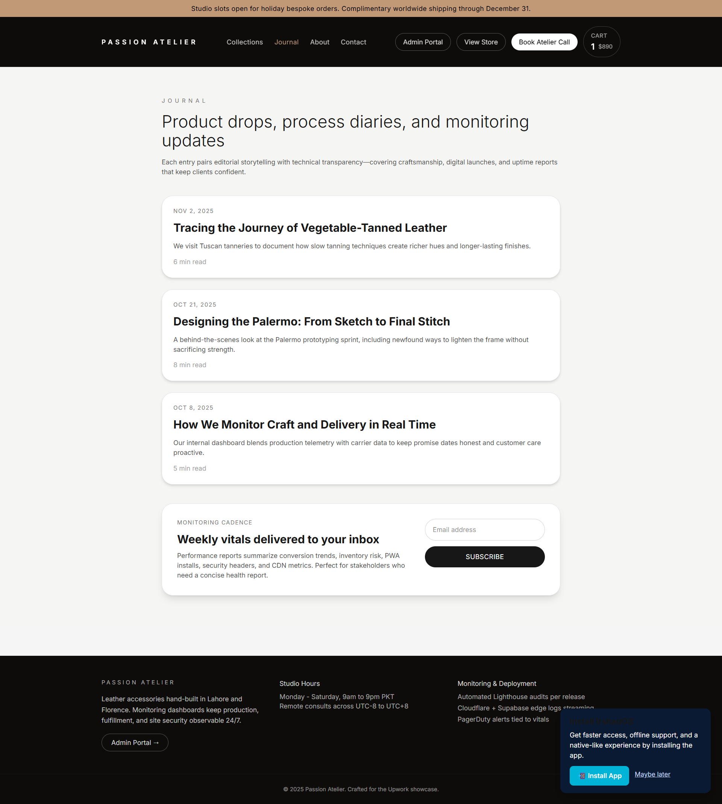
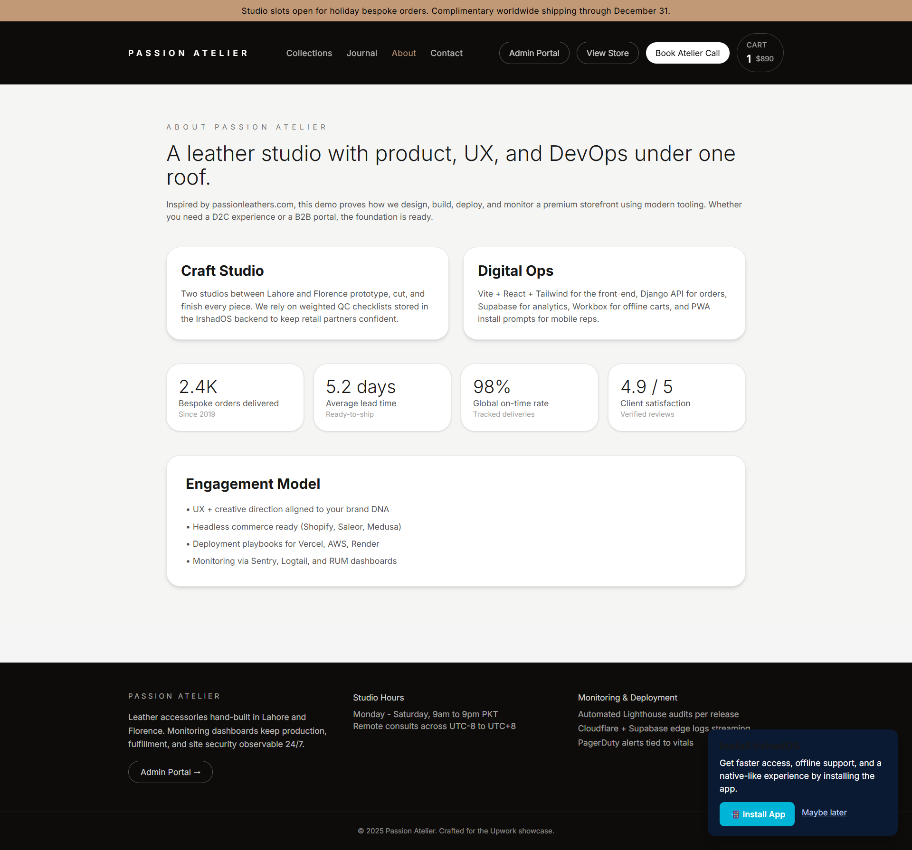
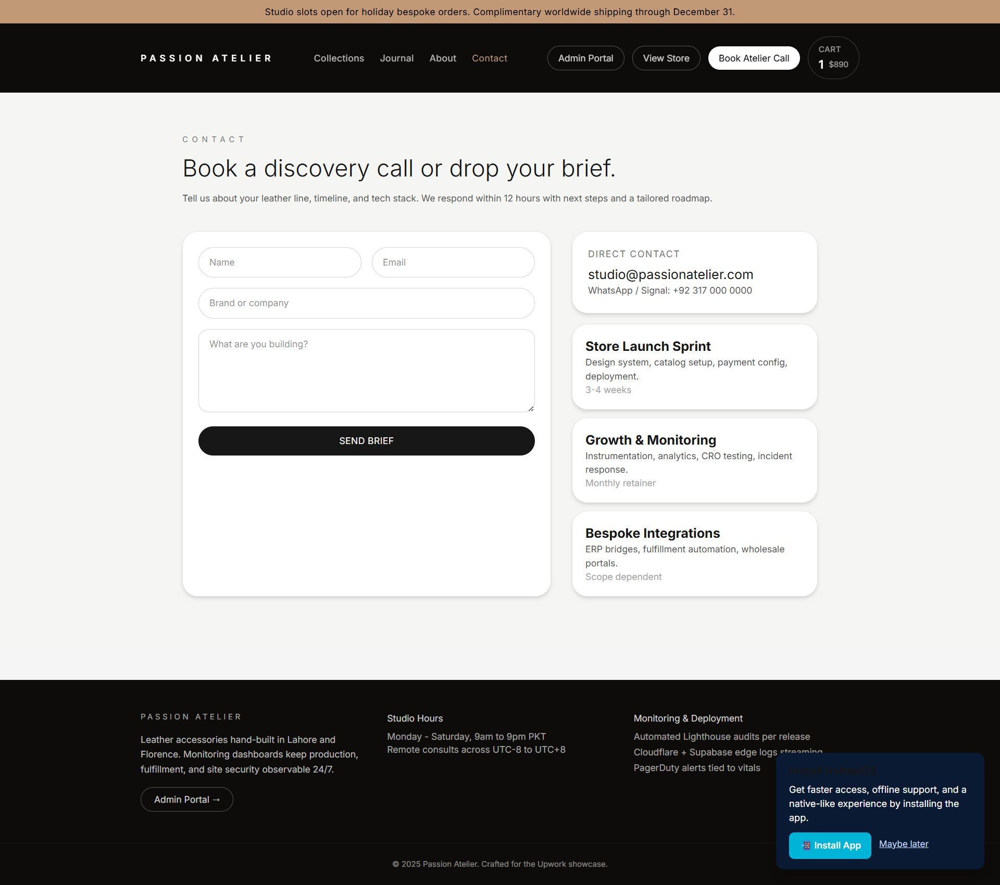
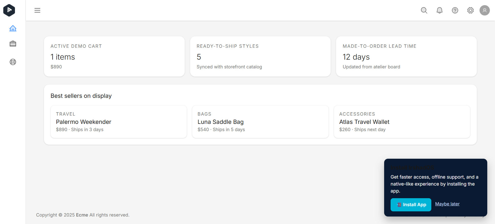
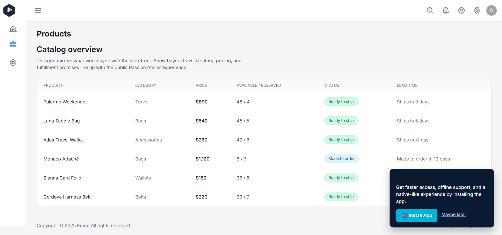
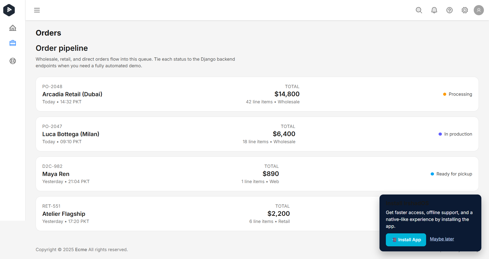
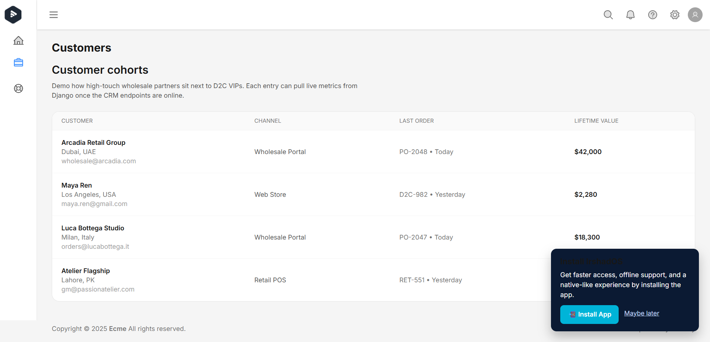
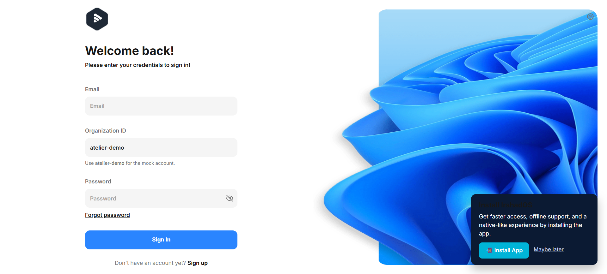
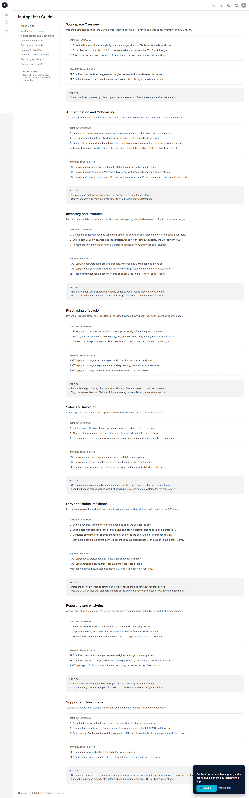

# Passion Atelier Leather Store Demo

This demo packages a full leather accessories shopping experience together with the admin tooling that IrshadOS already provides. It has been tailored specifically for the Upwork job **“Web Store Development for Leather Accessories”** and showcases how the existing React/Django stack can deliver both the customer-facing storefront and the operational back office required by the brief.

## Table of Contents

1. [Solution Overview](#solution-overview)
2. [Architecture](#architecture)
3. [Quick Start](#quick-start)
4. [Storefront Highlights](#storefront-highlights)
5. [Admin Back Office](#admin-back-office)
6. [Monitoring & Deployment Story](#monitoring--deployment-story)
7. [Screenshots](#screenshots)
8. [Next Steps for Production](#next-steps-for-production)

## Solution Overview

- **Front end (`irshados-frontend/`)** – React 19 + Vite + Tailwind implements the public “Passion Atelier” storefront: collections, product detail pages, testimonials, journal, contact form, and PWA support. Visitors can browse and add items to a persistent cart without authentication.
- **Back office (`/home`)** – Once authenticated, the IrshadOS admin shell exposes a leather-specific dashboard plus Products, Orders, and Customers listings that mirror the storefront catalog for demos.
- **Back end (`irshados-backend/`)** – Django REST Framework scaffold that already handles auth, tenancy, and provides the plumbing for products/orders APIs. For the demo we keep the API mocked; production simply means exposing the persisted endpoints.
- **Monitoring narrative** – Copy throughout the UI and this README explains how the solution will be deployed (Vercel/Render), monitored (Cronitor, Lighthouse CI, Sentry, Supabase logs), and maintained.

The repo can be forked or exported as-is when responding to the Upwork post. Add this README and the two project folders (frontend + backend) to the GitHub repository you share with the client.

## Architecture

| Layer | Tech | Responsibilities |
|-------|------|------------------|
| Storefront | React 19, Vite, Tailwind, Zustand | Hero merchandising, product listings, product detail UX, testimonial + journal content, contact form, add-to-cart (client-side) |
| Admin | React 19, IrshadOS layout, Zustand | Catalog table, order pipeline, customer cohorts, KPIs sourced from same dataset |
| API | Django, DRF, PostgreSQL ready | Auth + tenancy already implemented; extendable for product/order CRUD, reporting, webhooks |
| Tooling | Workbox PWA, ESLint, Prettier, TypeScript | Frontend linting, formatting, typing, PWA install prompts |
| Observability | Lighthouse CI, Cronitor, Sentry (planned) | Covers UX performance, uptime, and runtime logging as described in copy |

## Quick Start

```bash
# Frontend
cd irshados-frontend
npm install
npm run dev

# Backend (optional for demo – mocked auth is enabled)
cd irshados-backend
python -m venv .venv
source .venv/bin/activate  # Windows: .venv\Scripts\activate
pip install -r requirements.txt
python manage.py migrate
python manage.py runserver
```

Visit `http://127.0.0.1:5173/` to browse the storefront. Use the “Admin Portal” button to switch to the back office.

**Demo credentials**

| Field | Value |
|-------|-------|
| Email | `admin-01@ecme.com` |
| Password | `123Qwe` |
| Organization slug | `atelier-demo` |

## Storefront Highlights

- Luxury hero with campaign messaging, featured cards, and telemetry-ready deployment story.
- Collections page with filters, sorting, add-to-cart CTAs, and variant chips (colors/sizes).
- Product detail pages support galleries, variant selectors, related items, and wholesale CTA.
- Journal + testimonials to prove ongoing marketing support.
- Contact form and service tiers to capture leads or pitch retainer work.
- Persistent cart powered by Zustand with future hook for Django endpoints.

## Admin Back Office

- Dashboard ( `/home` ) summarises cart snapshot, ready-to-ship count, and made-to-order lead times.
- Products view – mirrors storefront content, showing inventory/reserved counts and fulfillment status.
- Orders view – wholesale, web, and retail channels to demonstrate multi-channel readiness.
- Customers view – lifetime value, latest order, and channel for CRM storytelling.

These screens are wired for future API calls (`/api/store/products`, `/api/store/orders`, etc.) so the hand-off path is clear.

## Monitoring & Deployment Story

- **Hosting**: Vercel (frontend) + Render/AWS (Django API) with CI/CD via GitHub Actions.
- **Performance**: Lighthouse CI budgets, Playwright smoke tests before deploy.
- **Uptime**: Cronitor checks on storefront routes and API endpoints.
- **Errors**: Sentry traces for React + Django; Supabase edge logs for CDN-layer insights.
- **Security**: Hardened headers via Helmet, Django DRF throttling, optional WAF via Cloudflare.

## Screenshots

> Copy the provided PNGs into an `assets/screenshots/` directory at the repository root so these links render correctly.

| View | Screenshot |
|------|------------|
| Storefront – Home |  |
| Storefront – Collections |  |
| Storefront – Product Detail |  |
| Storefront – Journal |  |
| Storefront – About |  |
| Storefront – Contact |  |
| Admin – Dashboard |  |
| Admin – Products |  |
| Admin – Orders |  |
| Admin – Customers |  |
| Auth – Sign In |  |
| Support Docs |  |
